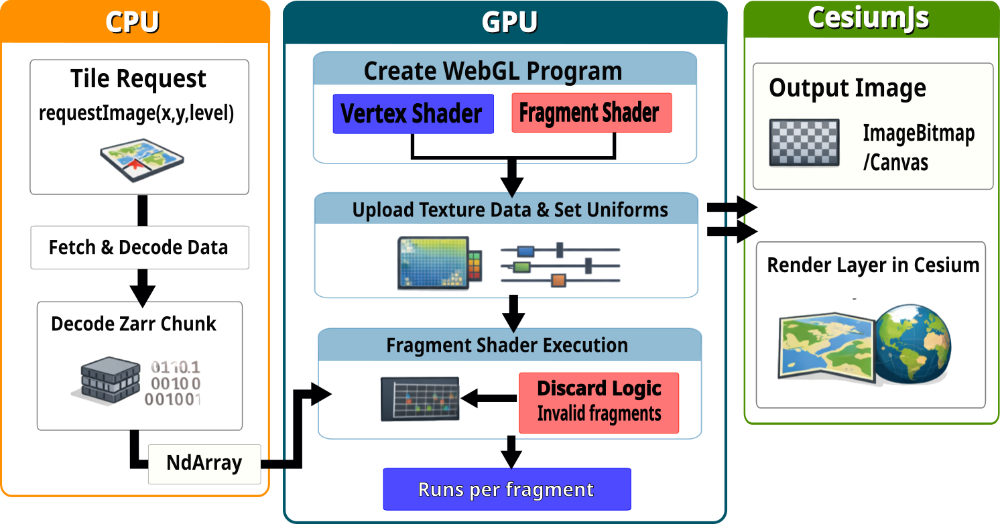

# Summary

Environmental sciences increasingly rely on multidimensional datasets describing oceanic, atmospheric, and terrestrial systems across space, depth, and time. Numerical models and remote sensing products routinely produce terabyte-scale data cubes with dimensions such as longitude, latitude, elevation, and time [@era5; @cmip6]. These datasets are commonly stored in chunked, cloud-optimized formats such as Zarr [@zarr], enabling scalable storage and parallel analysis.

Although storage and computational frameworks have evolved to support these multidimensional data structures [@zarr; @abernathey2021cloud], visualization workflows often transform them into two-dimensional raster products for web delivery, separating rendered outputs from the underlying data cube.

`Zarr-Cesium` is a TypeScript library that addresses these limitations. It enables interactive, browser-native visualization of multidimensional Zarr datasets within a 3D geospatial environment using CesiumJS [@cesiumjs]. The software streams chunked array data directly from object storage into the browser and renders it using WebGL2, without requiring backend services, tile-generation pipelines, or intermediate raster products.

The toolkit supports 2D scalar fields, 3D volumetric slicing, and animated vector fields. It is compatible with Zarr v2 and v3, multiscale pyramids [@geozarr; @ndpyramid], and CF-compliant metadata conventions [@cfconventions]. By integrating cloud-native data access with GPU-accelerated rendering, `Zarr-Cesium` enables interactive exploration of large scientific datasets directly from their cloud-hosted storage.

# Statement of Need

Although storage and computation frameworks have matured, visualization workflows remain fragmented across several partially overlapping ecosystems.

Scientific communication frequently relies on static figures or screenshots, which flatten inherently multidimensional systems into fixed two-dimensional views. Server-side tile-generation platforms convert datasets into raster products through Web Map Service (WMS) [@ogcwms] or custom APIs, requiring persistent backend infrastructure, preprocessing steps, and operational maintenance. These workflows also duplicate data into derived tile products, increasing storage requirements and separating rendered output from its canonical source.

Three-dimensional visualization is frequently essential for scientific interpretation. Many environmental processes exhibit strong vertical structure, including ocean stratification and thermocline variability, mixed-layer dynamics, and large-scale overturning circulation [@pickard1990]. Atmospheric systems similarly depend on vertical structure, including boundary layer evolution and convection [@stull1988]. Horizontal maps alone can obscure depth-dependent gradients, vertical shear, and subsurface anomalies that are central to physical interpretation. Interpretation of velocity fields further requires contextualizing transport pathways and circulation patterns across depth and time [@marshall1961atmosphere].

As multidimensional datasets become standard in operational modeling and reanalysis systems, there is a need for visualization approaches that preserve their native structure rather than flattening or duplicating them into derived products.

# Statement of the Field

Existing visualization ecosystems address parts of this problem but do not provide a unified client-side solution for multidimensional Zarr datasets.

Server-side tile-generation platforms convert multidimensional datasets into raster products exposed through WMS endpoints or custom APIs. Systems such as GeoServer [@geoserver] and ncWMS [@blower2013ncwms] enable serving NetCDF-based datasets as map layers but require persistent backend infrastructure and preprocessing steps to generate tiles.

Cloud-native raster ecosystems based on Cloud-Optimized GeoTIFFs (COGs) [@ogccog2023] enable efficient streaming of large two-dimensional imagery products. Tools such as TiTiler [@titiler] provide scalable server-side generation of map tiles directly from COGs. However, these approaches are fundamentally oriented toward two-dimensional raster data. Extending them to higher-dimensional data cubes typically requires precomputed slicing, separate endpoints for each non-spatial dimension, or additional backend logic to manage depth and time selection.

For Zarr datasets, backend tile-generation solutions such as titiler-xarray [@titilerxarray] and xpublish-tiles [@xpublishtiles] expose Zarr-backed arrays through tile APIs. While these tools allow dynamic slicing of multidimensional data, they still depend on server-side infrastructure to perform array access, rasterization, and tile generation. Visualization therefore remains mediated by backend services, and rendered products are transmitted as image tiles rather than structured array subsets.

Client-side geospatial engines such as CesiumJS [@cesiumjs] provide powerful 3D globe visualization but do not natively support streaming and slicing of multidimensional chunked array formats such as Zarr. Conversely, browser-based Zarr libraries such as Zarrita [@zarrita] enable direct access to chunked arrays in JavaScript but do not provide geospatial integration, volumetric slicing, or GPU-based colormapping pipelines.

Consequently, no general-purpose framework currently supports direct streaming of multidimensional Zarr arrays from object storage, automatic interpretation of CF-compliant metadata, dynamic slice computation in the browser, GPU-based rendering of scalar and vector fields, and fully static deployment without backend services. `Zarr-Cesium` fills this gap by integrating these capabilities into a coherent client-side architecture.

# Software Design

`Zarr-Cesium` is implemented in TypeScript and organized around three primary provider classes: `ZarrLayerProvider` for 2D scalar fields, `ZarrCubeProvider` for 3D volumetric slicing, and `ZarrCubeVelocityProvider` for animated vector fields. These providers encapsulate data access, multidimensional slicing logic, and rendering integration.

All providers access Zarr datasets via a browser-based `FetchStore`, supporting HTTP range requests, consolidated metadata, and both Zarr v2 and v3 specifications. Multiscale pyramid datasets are detected through `multiscales` metadata, and resolution levels are selected dynamically based on view scale. A lightweight in-memory cache maintains recently accessed multiscale levels.

Dimension identification is performed automatically using CF `standard_name` attributes [@cfconventions] and configurable alias mappings. Geographic bounds from Cesium tiles or camera extents are translated into array index ranges, with automatic CRS detection between EPSG:4326 and EPSG:3857. Zarr slice arguments are constructed dynamically, and value-based selectors (e.g., timestamps or depths) are converted to nearest-index selections.

To maintain interactivity, the system limits concurrent chunk requests and uses `AbortController` instances to cancel stale requests during rapid navigation. Only visible spatial subsets are requested, and multiscale level selection reduces resolution at broader zoom levels.

Rendering is performed using WebGL2. For scalar fields, float32 array subsets are uploaded as `R32F` textures and processed in fragment shaders that apply scale-factor correction, normalization, no-data masking, and dynamic colormapping. Because scaling and colormapping occur on the GPU, visual parameters can be adjusted without re-fetching data.

For volumetric cubes, array subsets are reshaped into ndarray structures and horizontal or vertical slices are generated dynamically. Textured Cesium `Primitive` geometries are constructed, and elevation values are converted into globe-compatible heights with optional vertical exaggeration or subsurface offsets. Slices are regenerated when dimension selectors or styling parameters change.

Velocity fields are handled by loading U and V components from separate Zarr stores, extracting elevation slices, and passing the data to the `cesium-wind-layer` library [@cesiumwindlayer] for particle-based animation. Multiple elevation layers can be rendered simultaneously, enabling stacked three-dimensional flow visualizations.

By combining selective chunk loading, multiscale resolution management, GPU-based rendering, and minimal data duplication, the architecture enables interactive exploration of datasets significantly larger than browser memory limits. Performance is constrained primarily by chunk size and network bandwidth rather than total dataset size.

> Representation of the workflow of the `Zarr-Cesium` package, from tile request to WebGL layer generation on the map.

# Conclusion

`Zarr-Cesium` integrates cloud-native chunked storage access, CF-aware dimension resolution, multiscale pyramid handling, and GPU-based rendering into a unified client-side architecture.

The software does not introduce new rendering algorithms; rather, it formalizes a reusable and deployment-friendly approach for connecting multidimensional Zarr data directly to browser-based 3D environments. By rendering array subsets in the browser without intermediate rasterization or server-side preprocessing, `Zarr-Cesium` preserves fidelity to the canonical dataset stored in object storage and reduces ambiguity between analysis products and visualization artifacts.

Beyond infrastructure considerations, this architecture supports more transparent and exploratory analysis of inherently multidimensional environmental systems. Interactive slicing and dynamic rendering allow datasets to be examined in their full spatial and temporal structure rather than as predefined two-dimensional views. As cloud-native formats increasingly replace file-based distribution models, coupling scalable storage with browser-native visualization becomes an essential component of modern scientific infrastructure. `Zarr-Cesium` contributes such a component, supporting reproducible, interactive publication and communication of environmental data.

# Acknowledgements

This work builds upon the open-source efforts of the CesiumJS, Zarrita, and cesium-wind-layer communities. Storage and testing infrastructure were supported by JASMIN, the UK’s environmental data analysis facility. The project forms part of the AtlantiS initiative led by the National Oceanography Centre.

# References
